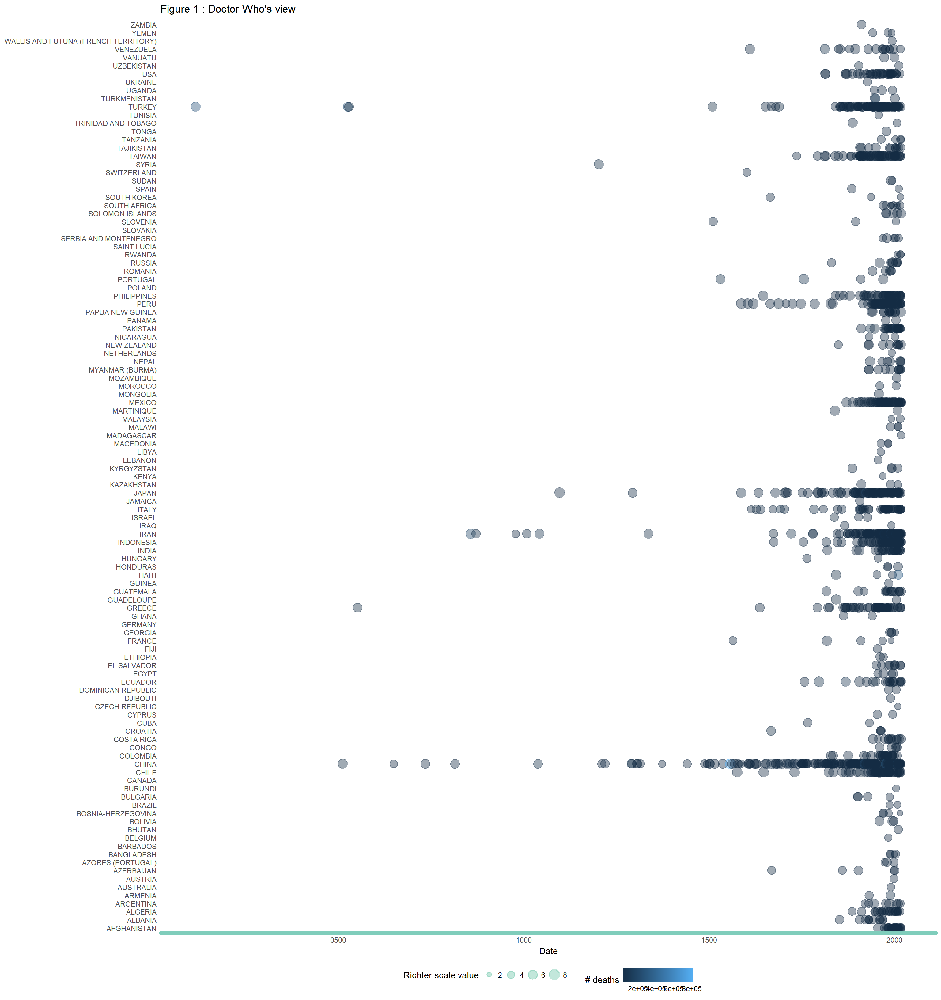

README
================
José Antonio García Ramirez
January 12, 2018

[](https://travis-ci.org/clems/FouR)

<!-- README.md is generated from README.Rmd. Please edit that file -->
For the beautiful visualizations I recommend checking the file *README.HTML*

INTRODUCTION
------------

The FouR package is created (in its first release) to visualize NOAA earthquake data. It processes data from [NOAA database](https://www.ngdc.noaa.gov/nndc/struts/form?t=101650&s=1&d=1) and visualizes them using `ggplot2` and `leaflet` packages.

This vignette two process: - Cleaning - Two different visualizations (over time - like [Doctor Who](https://en.wikipedia.org/wiki/Doctor_Who) would see it - and country)

DATA
----

About the NOAA earthquake data. the data come can be obtained from [NOAA Significant Earthquake Database](https://www.ngdc.noaa.gov/nndc/struts/form?t=101650&s=1&d=1).

It is evident that the data set has numerous columns with [null](https://en.wikipedia.org/wiki/Null_(SQL)) or missing values, <span style="color:RED"> although a future and interesting work for this package would be to apply data imputation techniques to the dataset </span>. For the above you can use the function `eq_clean_data()` and `eq_location_clean()`

``` r
head(data, 3)
#>     I_D FLAG_TSUNAMI YEAR MONTH DAY HOUR MINUTE SECOND FOCAL_DEPTH
#> 1 10265         <NA>   37     4   9   NA     NA   <NA>          NA
#> 2  7896         <NA>   46    10  23   NA     NA   <NA>          NA
#> 3    58         <NA>   79     8  24   NA     NA   <NA>          NA
#>   EQ_PRIMARY EQ_MAG_MW EQ_MAG_MS EQ_MAG_MB EQ_MAG_ML EQ_MAG_MFA EQ_MAG_UNK
#> 1         NA        NA        NA      <NA>        NA       <NA>         NA
#> 2        6.5        NA       6.5      <NA>        NA       <NA>         NA
#> 3         NA        NA        NA      <NA>        NA       <NA>         NA
#>   INTENSITY COUNTRY STATE                    LOCATION_NAME LATITUDE
#> 1        NA  TURKEY  <NA>       TURKEY:  ANTAKYA (ANTIOCH)   36.100
#> 2         8   CHINA  <NA> CHINA:  HENAN PROVINCE:  NANYANG   33.000
#> 3        10   ITALY  <NA>          ITALY:  NAPLES (NAPOLI)   40.821
#>   LONGITUDE REGION_CODE DEATHS DEATHS_DESCRIPTION MISSING
#> 1    36.100         140     NA                  3    <NA>
#> 2   112.500          30     NA                  2    <NA>
#> 3    14.426         130     NA                 NA    <NA>
#>   MISSING_DESCRIPTION INJURIES INJURIES_DESCRIPTION
#> 1                  NA       NA                   NA
#> 2                  NA       NA                   NA
#> 3                  NA       NA                   NA
#>   DAMAGE_MILLIONS_DOLLARS DAMAGE_DESCRIPTION HOUSES_DESTROYED
#> 1                    <NA>                  4               NA
#> 2                    <NA>                  2               NA
#> 3                    <NA>                 NA               NA
#>   HOUSES_DESTROYED_DESCRIPTION HOUSES_DAMAGED HOUSES_DAMAGED_DESCRIPTION
#> 1                           NA             NA                         NA
#> 2                            2             NA                         NA
#> 3                           NA             NA                         NA
#>   TOTAL_DEATHS TOTAL_DEATHS_DESCRIPTION TOTAL_MISSING
#> 1           NA                        3          <NA>
#> 2           NA                        2          <NA>
#> 3         3500                        4          <NA>
#>   TOTAL_MISSING_DESCRIPTION TOTAL_INJURIES TOTAL_INJURIES_DESCRIPTION
#> 1                      <NA>             NA                         NA
#> 2                      <NA>             NA                         NA
#> 3                      <NA>             NA                         NA
#>   TOTAL_DAMAGE_MILLIONS_DOLLARS TOTAL_DAMAGE_DESCRIPTION
#> 1                          <NA>                        4
#> 2                          <NA>                        2
#> 3                          <NA>                       NA
#>   TOTAL_HOUSES_DESTROYED TOTAL_HOUSES_DESTROYED_DESCRIPTION
#> 1                     NA                                 NA
#> 2                     NA                                  2
#> 3                     NA                                 NA
#>   TOTAL_HOUSES_DAMAGED TOTAL_HOUSES_DAMAGED_DESCRIPTION YEAR2      Date2
#> 1                   NA                               NA  0037   0037.4.9
#> 2                   NA                               NA  0046 0046.10.23
#> 3                   NA                               NA  0079  0079.8.24
#>         Date
#> 1 0037-04-09
#> 2 0046-10-23
#> 3 0079-08-24
```

Package content
---------------

There are ten functions within the package:

-   `fecha()`
-   `eq_clean_data()`
-   `eq_location_clean()`
-   `theme_timeline()`
-   `GeomTimeline()`
-   `GeomTimelineLabel()`
-   `theme_timeline()`
-   `geom_timeline()`
-   `geom_timeline_label()`
-   `eq_map()`

But only the following functions are exported:

-   `fecha()`
-   `eq_clean_data()`
-   `eq_location_clean()`
-   `theme_timeline()`
-   `GeomTimeline()`
-   `GeomTimelineLabel()`
-   `theme_timeline()`
-   `eq_map()`

Data cleaning
-------------

It is evident that the data set has numerous columns with [null](https://en.wikipedia.org/wiki/Null_(SQL)) or missing values, <span style="color:RED"> although a future and interesting work for this package would be to apply data imputation techniques to the dataset </span>. For the above you can use the function `eq_clean_data()` and `eq_location_clean()`

Visualization of earthquakes by time and place :
------------------------------------------------

1.  [Doctor-Who](https://en.wikipedia.org/wiki/Doctor_Who)'s [view](https://en.oxforddictionaries.com/definition/view) ( or style1), **all the time** and **all the countries** at once. You can visualize earthquakes in all dataset's time variable *YEAR* without filter by the columns *COUNTRY* and *YEAR* and using the package *ggplot* and the recently implemented `geom_`, `geom_timeline` and `geom_timeline_label`. (you must pay attention with the column so that the visualization is of a suitable size and not empty, as in every ggplot´s function, one must have congruent with the variables' name of the dataset and the parameters of `ggplot2::aes` function.)[1]

``` r
data %>%
filter( DEATHS>0) %>%
     ggplot(aes(x = Date,
                y = COUNTRY,
                color = DEATHS,
                size = as.numeric(EQ_PRIMARY)
     )) +
     geom_timeline() +
     #geom_timeline_label(aes(label = LOCATION_NAME)) +
     theme_timeline() +
     labs(size = "Richter scale value", color = "# deaths",
          title = "Figure 1 : Doctor Who's view")
```



1.  No-Doctor-Who's (style2), not all the time neither all the countries at once. You can visualize earthquakes in a single country after filter by the column `COUNTRY` or many others, (you must pay attention with the columns of *YEAR* and *DEATHS* so that the visualization is of a suitable size and not empty, as in every ggplot´s function, one must have congruent with the variables' name of the dataset and the parameters of `ggplot2::aes` function.)

``` r
data %>%
filter(COUNTRY %in% c("USA"), 2020 > YEAR,  YEAR > 2000, DEATHS>0) %>%
     ggplot(aes(x = Date,
                y = COUNTRY,
                color = DEATHS,
                size = as.numeric(EQ_PRIMARY)
     )) +
     geom_timeline() +
     geom_timeline_label(aes(label = LOCATION_NAME)) +
     theme_timeline() +
     labs(size = "Richter scale value", color = "# deaths",
     title = "Figure 2: Human vision")
```


1.  Style3, not all the time neither all the countries at once. You can visualize earthquakes in a single country after filter by the column *COUNTRY* or many others, (you must pay attention with the columns of *YEAR* and *DEATHS* as in style2)

``` r
data %>%
filter(COUNTRY %in% c("USA", "MEXICO", "JAPAN"), 2020 > YEAR,  YEAR > 2000, DEATHS>0) %>%
     ggplot(aes(x = Date,
                y = COUNTRY,
                color = DEATHS,
                size = as.numeric(EQ_PRIMARY)
     )) +
     geom_timeline() +
     geom_timeline_label(aes(label = LOCATION_NAME)) +
     theme_timeline() +
     labs(size = "Richter scale value", color = "# deaths",
     title = "Figure 3: Human vision")
```


Visualize earthquakes on a pretty map
=====================================

Using the `leaflet` package it is very easy to make beautiful interactive maps using the function `eq_map()`.There are two options to use this function one without using the function `eq_create_label()` from where we get the following map:

``` r
data %>% 
   dplyr::filter(COUNTRY == "MEXICO" & lubridate::year(Date) >= 2000) %>% 
  eq_map(annot_col = "Date")
```

<!--html_preserve-->

<script type="application/json" data-for="htmlwidget-04cdb9aa37256be0ba25">{"x":{"options":{"crs":{"crsClass":"L.CRS.EPSG3857","code":null,"proj4def":null,"projectedBounds":null,"options":{}}},"calls":[{"method":"addProviderTiles","args":["Esri.WorldTerrain",null,null,{"errorTileUrl":"","noWrap":false,"zIndex":null,"unloadInvisibleTiles":null,"updateWhenIdle":null,"detectRetina":false,"reuseTiles":false}]},{"method":"addTiles","args":["//{s}.tile.openstreetmap.org/{z}/{x}/{y}.png",null,null,{"minZoom":0,"maxZoom":18,"maxNativeZoom":null,"tileSize":256,"subdomains":"abc","errorTileUrl":"","tms":false,"continuousWorld":false,"noWrap":false,"zoomOffset":0,"zoomReverse":false,"opacity":1,"zIndex":null,"unloadInvisibleTiles":null,"updateWhenIdle":null,"detectRetina":false,"reuseTiles":false,"attribution":"&copy; <a href=\"http://openstreetmap.org\">OpenStreetMap<\/a> contributors, <a href=\"http://creativecommons.org/licenses/by-sa/2.0/\">CC-BY-SA<\/a>"}]},{"method":"addCircleMarkers","args":[[18.194,32.319,16.87,18.77,17.488,26.319,17.302,32.456,32.437,32.297,16.396,17.844,16.493,16.917,17.552,17.385,14.742,17.842,15.022,18.584,16.737],[-95.908,-115.322,-100.113,-104.104,-101.303,-86.606,-100.198,-115.315,-115.165,-115.278,-97.782,-99.963,-98.231,-99.381,-100.816,-100.656,-92.409,-95.524,-93.899,-98.399,-94.946],[5.9,5.5,5.3,7.5,6.1,5.8,6,5.1,5.9,7.2,6.2,6.4,7.4,6.2,7.2,6.4,6.9,6.3,8.2,7.1,6.1],null,null,{"lineCap":null,"lineJoin":null,"clickable":true,"pointerEvents":null,"className":"","stroke":true,"color":"#6962df","weight":2,"opacity":0.5,"fill":true,"fillColor":"#6962df","fillOpacity":0.2,"dashArray":null},null,null,["2002-01-30","2002-02-22","2002-09-25","2003-01-22","2004-01-01","2006-09-10","2007-04-13","2008-02-09","2009-12-30","2010-04-04","2010-06-30","2011-12-11","2012-03-20","2013-08-21","2014-04-18","2014-05-08","2014-07-07","2014-07-29","2017-09-08","2017-09-19","2017-09-23"],null,null,null,null]}],"limits":{"lat":[14.742,32.456],"lng":[-115.322,-86.606]}},"evals":[],"jsHooks":[]}</script>
<!--/html_preserve-->
And the other one using it

``` r
data %>%
 dplyr::filter(COUNTRY == "MEXICO" & lubridate::year(Date) >= 2000) %>% 
  dplyr::mutate(popup_text = eq_create_label(.)) %>% 
  eq_map(annot_col = "popup_text")
```

<!--html_preserve-->

<script type="application/json" data-for="htmlwidget-c07146db85019c0244dc">{"x":{"options":{"crs":{"crsClass":"L.CRS.EPSG3857","code":null,"proj4def":null,"projectedBounds":null,"options":{}}},"calls":[{"method":"addProviderTiles","args":["Esri.WorldTerrain",null,null,{"errorTileUrl":"","noWrap":false,"zIndex":null,"unloadInvisibleTiles":null,"updateWhenIdle":null,"detectRetina":false,"reuseTiles":false}]},{"method":"addTiles","args":["//{s}.tile.openstreetmap.org/{z}/{x}/{y}.png",null,null,{"minZoom":0,"maxZoom":18,"maxNativeZoom":null,"tileSize":256,"subdomains":"abc","errorTileUrl":"","tms":false,"continuousWorld":false,"noWrap":false,"zoomOffset":0,"zoomReverse":false,"opacity":1,"zIndex":null,"unloadInvisibleTiles":null,"updateWhenIdle":null,"detectRetina":false,"reuseTiles":false,"attribution":"&copy; <a href=\"http://openstreetmap.org\">OpenStreetMap<\/a> contributors, <a href=\"http://creativecommons.org/licenses/by-sa/2.0/\">CC-BY-SA<\/a>"}]},{"method":"addCircleMarkers","args":[[18.194,32.319,16.87,18.77,17.488,26.319,17.302,32.456,32.437,32.297,16.396,17.844,16.493,16.917,17.552,17.385,14.742,17.842,15.022,18.584,16.737],[-95.908,-115.322,-100.113,-104.104,-101.303,-86.606,-100.198,-115.315,-115.165,-115.278,-97.782,-99.963,-98.231,-99.381,-100.816,-100.656,-92.409,-95.524,-93.899,-98.399,-94.946],[5.9,5.5,5.3,7.5,6.1,5.8,6,5.1,5.9,7.2,6.2,6.4,7.4,6.2,7.2,6.4,6.9,6.3,8.2,7.1,6.1],null,null,{"lineCap":null,"lineJoin":null,"clickable":true,"pointerEvents":null,"className":"","stroke":true,"color":"#6962df","weight":2,"opacity":0.5,"fill":true,"fillColor":"#6962df","fillOpacity":0.2,"dashArray":null},null,null,["<strong>Location:<\/strong> MEXICO:  VERACRUZ:  SAN ANDRES TUXTLA, TUXTEPEC<br><strong>Magnitude<\/strong> 5.9","<strong>Location:<\/strong> MEXICO:  MEXICALI, BAJA CALIFORNIA<br><strong>Magnitude<\/strong> 5.5","<strong>Location:<\/strong> MEXICO:  ACAPULCO<br><strong>Magnitude<\/strong> 5.3","<strong>Location:<\/strong> MEXICO:  VILLA DE ALVAREZ, COLIMA, TECOMAN, JALISCO<br><strong>Magnitude<\/strong> 7.5<br><strong>Total deaths:<\/strong> 29","<strong>Location:<\/strong> MEXICO:  GUERRERO, MEXICO CITY<br><strong>Magnitude<\/strong> 6.1","<strong>Location:<\/strong> GULF OF MEXICO<br><strong>Magnitude<\/strong> 5.8","<strong>Location:<\/strong> MEXICO:  GUERRERO, ATOYAC<br><strong>Magnitude<\/strong> 6","<strong>Location:<\/strong> MEXICO:  BAJA CALIFORNIA<br><strong>Magnitude<\/strong> 5.1","<strong>Location:<\/strong> MEXICO:  MEXICALI<br><strong>Magnitude<\/strong> 5.9","<strong>Location:<\/strong> MEXICO:  BAJA CALIFORNIA<br><strong>Magnitude<\/strong> 7.2<br><strong>Total deaths:<\/strong> 2","<strong>Location:<\/strong> MEXICO:  SAN ANDRES HUAXPALTEPEC<br><strong>Magnitude<\/strong> 6.2<br><strong>Total deaths:<\/strong> 1","<strong>Location:<\/strong> MEXICO:  GUERRERO<br><strong>Magnitude<\/strong> 6.4<br><strong>Total deaths:<\/strong> 2","<strong>Location:<\/strong> MEXICO:  GUERRERO, OAXACA<br><strong>Magnitude<\/strong> 7.4<br><strong>Total deaths:<\/strong> 2","<strong>Location:<\/strong> MEXICO:  ACAPULCO<br><strong>Magnitude<\/strong> 6.2","<strong>Location:<\/strong> MEXICO:  GUERRERO; MEXICO CITY<br><strong>Magnitude<\/strong> 7.2","<strong>Location:<\/strong> MEXICO:  TECPAN<br><strong>Magnitude<\/strong> 6.4","<strong>Location:<\/strong> MEXICO; GUATEMALA:  SAN MARCOS<br><strong>Magnitude<\/strong> 6.9<br><strong>Total deaths:<\/strong> 3","<strong>Location:<\/strong> MEXICO:  OAXACA<br><strong>Magnitude<\/strong> 6.3<br><strong>Total deaths:<\/strong> 1","<strong>Location:<\/strong> MEXICO: OAXACA, CHIAPAS, TABASCO; GUATEMALA<br><strong>Magnitude<\/strong> 8.2<br><strong>Total deaths:<\/strong> 98","<strong>Location:<\/strong> MEXICO: MEXICO CITY, MORELOS, PUEBLA<br><strong>Magnitude<\/strong> 7.1<br><strong>Total deaths:<\/strong> 369","<strong>Location:<\/strong> MEXICO:  OAXACA<br><strong>Magnitude<\/strong> 6.1<br><strong>Total deaths:<\/strong> 5"],null,null,null,null]}],"limits":{"lat":[14.742,32.456],"lng":[-115.322,-86.606]}},"evals":[],"jsHooks":[]}</script>
<!--/html_preserve-->

[1] Thanks to my [brother](https://www.facebook.com/lucaridavidmisticmaster) and my friend [Claudia](https://www.facebook.com/Ayla.occord?pnref=friends.search) for the idea about figure 1.
